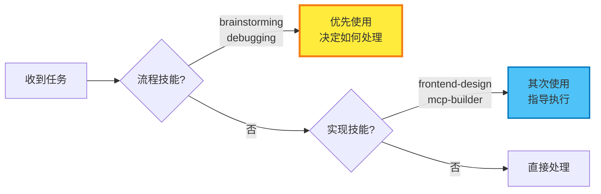
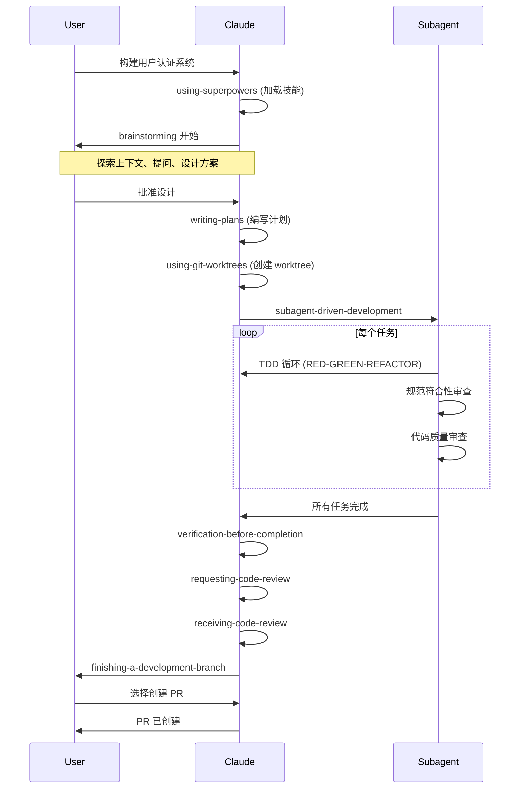
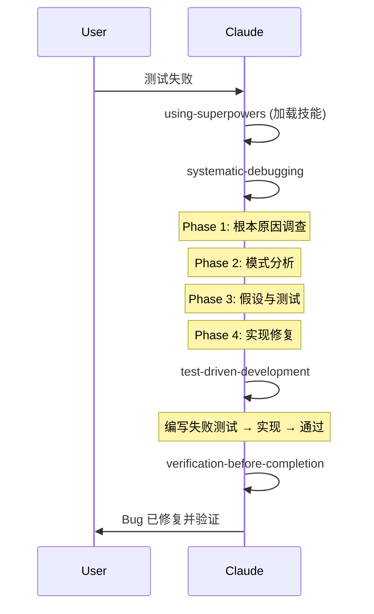
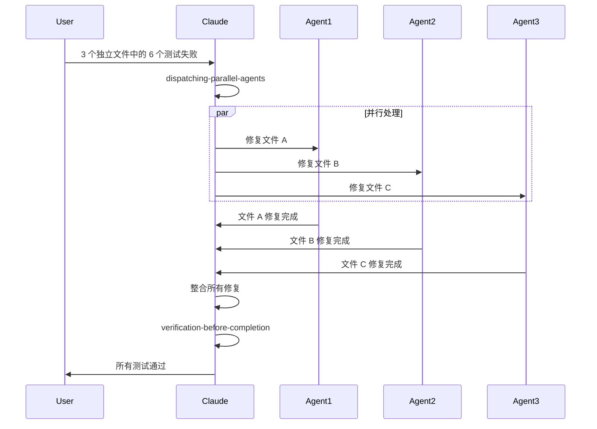
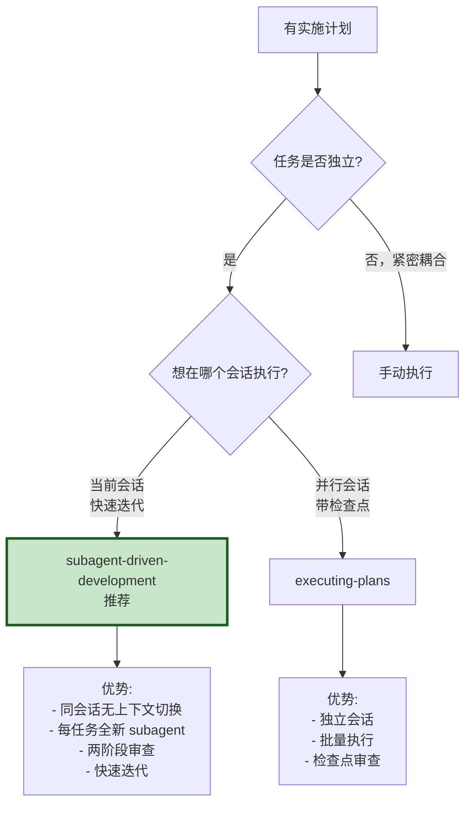
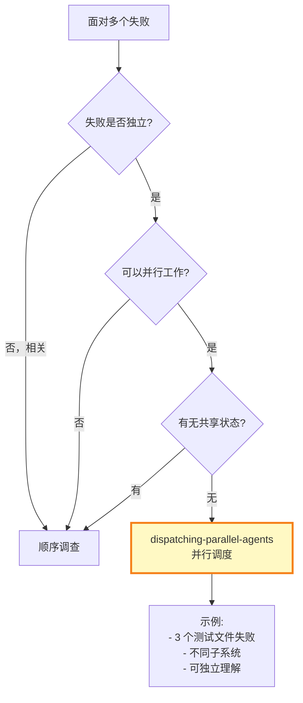
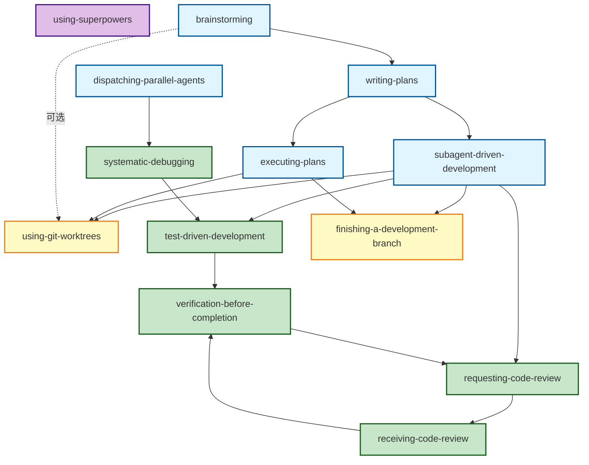

# Superpowers 技能框架

## 概述

Superpowers 是一套完整的软件开发最佳实践技能体系，强调**设计先行、测试驱动、质量门控、系统化工作流**。

## 核心工作流程

```mermaid
graph TB
    Start([开始新任务]) --> UsingSuperpowers[using-superpowers<br/>发现和加载技能]

    UsingSuperpowers --> NeedDesign{需要创建/修改<br/>功能?}

    NeedDesign -->|是| Brainstorming[brainstorming<br/>头脑风暴与设计]
    NeedDesign -->|否，修复问题| Debugging{是 Bug 或<br/>测试失败?}

    %% Brainstorming 流程
    Brainstorming --> ExploreContext[探索项目上下文]
    ExploreContext --> AskQuestions[提出澄清问题]
    AskQuestions --> ProposeOptions[提出 2-3 种方案]
    ProposeOptions --> PresentDesign[呈现设计]
    PresentDesign --> DesignApproved{设计获得批准?}
    DesignApproved -->|否| AskQuestions
    DesignApproved -->|是| WriteSpec[编写设计文档]
    WriteSpec --> SpecReview[规范自审]
    SpecReview --> UserApproveSpec{用户批准规范?}
    UserApproveSpec -->|否| WriteSpec
    UserApproveSpec -->|是| WritingPlans

    %% Writing Plans 流程
    subgraph PlanPhase[计划阶段]
        WritingPlans[writing-plans<br/>编写实施计划]
        WritingPlans --> DefineFiles[定义文件结构]
        DefineFiles --> BreakTasks[分解细粒度任务]
        BreakTasks --> PlanSelfReview[计划自我审查]
        PlanSelfReview --> SavePlan[保存计划]
    end

    SavePlan --> ChooseExecution{选择执行方式?}

    %% Subagent-Driven Development
    ChooseExecution -->|Subagent-Driven<br/>推荐| SetupWorktree1[using-git-worktrees<br/>设置隔离工作空间]
    SetupWorktree1 --> SubagentDev[subagent-driven-development<br/>每任务一个 subagent]

    subgraph SubagentLoop[Subagent 循环]
        SubagentDev --> DispatchImpl[派发 implementer subagent]
        DispatchImpl --> ImplQuestions{Subagent 提问?}
        ImplQuestions -->|是| AnswerQ[回答问题]
        AnswerQ --> DispatchImpl
        ImplQuestions -->|否| ImplWork[实现、测试、提交]
        ImplWork --> SpecReview2[规范符合性审查]
        SpecReview2 --> SpecOK{符合规范?}
        SpecOK -->|否| ImplWork
        SpecOK -->|是| QualityReview[代码质量审查]
        QualityReview --> QualityOK{质量通过?}
        QualityOK -->|否| ImplWork
        QualityOK -->|是| MarkComplete[标记任务完成]
        MarkComplete --> MoreTasks{还有任务?}
        MoreTasks -->|是| DispatchImpl
    end

    MoreTasks -->|否| FinalReview[最终代码审查]
    FinalReview --> FinishingBranch

    %% Executing Plans
    ChooseExecution -->|Inline Execution| SetupWorktree2[using-git-worktrees<br/>设置隔离工作空间]
    SetupWorktree2 --> ExecutingPlans[executing-plans<br/>批量执行计划]

    subgraph ExecLoop[执行循环]
        ExecutingPlans --> LoadPlan[加载和审查计划]
        LoadPlan --> ExecTask[执行任务]
        ExecTask --> ExecVerify[验证]
        ExecVerify --> ExecMore{还有任务?}
        ExecMore -->|是| ExecTask
    end

    ExecMore -->|否| FinishingBranch

    %% Debugging 流程
    Debugging -->|是| SystematicDebugging[systematic-debugging<br/>系统化调试]

    subgraph DebugPhase[调试四阶段]
        SystematicDebugging --> Phase1[Phase 1: 根本原因调查]
        Phase1 --> Phase2[Phase 2: 模式分析]
        Phase2 --> Phase3[Phase 3: 假设与测试]
        Phase3 --> Phase4[Phase 4: 实现修复]
    end

    Phase4 --> TDD

    %% TDD 流程
    subgraph TDDLoop[TDD 循环]
        TDD[test-driven-development<br/>测试驱动开发]
        TDD --> Red[RED: 编写失败测试]
        Red --> VerifyRed[验证测试失败]
        VerifyRed --> Green[GREEN: 最小实现]
        Green --> VerifyGreen[验证测试通过]
        VerifyGreen --> Refactor[REFACTOR: 重构]
        Refactor --> MoreFeatures{更多功能?}
        MoreFeatures -->|是| Red
    end

    MoreFeatures -->|否| Verification

    %% Verification
    Verification[verification-before-completion<br/>完成前验证]
    Verification --> RunTests[运行验证命令]
    RunTests --> CheckOutput[检查输出]
    CheckOutput --> AllPass{全部通过?}
    AllPass -->|否| Debugging
    AllPass -->|是| CodeReview

    %% Code Review
    subgraph ReviewPhase[代码审查]
        CodeReview[requesting-code-review<br/>请求代码审查]
        CodeReview --> DispatchReviewer[派发 code-reviewer subagent]
        DispatchReviewer --> ReceiveFeedback[receiving-code-review<br/>接收审查反馈]
        ReceiveFeedback --> FeedbackOK{反馈需要修改?}
        FeedbackOK -->|是| ImplementFeedback[实施反馈]
        ImplementFeedback --> Verification
        FeedbackOK -->|否| FinishingBranch
    end

    %% Finishing
    FinishingBranch[finishing-a-development-branch<br/>完成开发分支]
    FinishingBranch --> VerifyTests[验证测试通过]
    VerifyTests --> OfferOptions[提供 4 个选项]
    OfferOptions --> UserChoice{用户选择?}

    UserChoice -->|1. 本地合并| LocalMerge[本地合并]
    UserChoice -->|2. 创建 PR| CreatePR[推送并创建 PR]
    UserChoice -->|3. 保持原样| KeepAsIs[保持分支]
    UserChoice -->|4. 丢弃| Discard[丢弃工作]

    LocalMerge --> CleanupWorktree[清理 worktree]
    CreatePR --> CleanupWorktree
    Discard --> CleanupWorktree
    KeepAsIs --> End

    CleanupWorktree --> End([完成])

    %% Parallel Agents (独立任务)
    Start -->|多个独立任务| ParallelAgents[dispatching-parallel-agents<br/>调度并行 agents]
    ParallelAgents --> IdentifyDomains[识别独立领域]
    IdentifyDomains --> DispatchAgents[并行派发 agents]
    DispatchAgents --> CollectResults[收集结果]
    CollectResults --> Integrate[整合修复]
    Integrate --> Verification

    %% 样式
    classDef skillNode fill:#e1f5ff,stroke:#01579b,stroke-width:2px
    classDef decisionNode fill:#fff9c4,stroke:#f57f17,stroke-width:2px
    classDef phaseNode fill:#f3e5f5,stroke:#4a148c,stroke-width:2px
    classDef endNode fill:#c8e6c9,stroke:#1b5e20,stroke-width:3px

    class UsingSuperpowers,Brainstorming,WritingPlans,SubagentDev,ExecutingPlans,SystematicDebugging,TDD,Verification,CodeReview,ReceiveFeedback,FinishingBranch,ParallelAgents skillNode
    class NeedDesign,Debugging,DesignApproved,UserApproveSpec,ChooseExecution,ImplQuestions,SpecOK,QualityOK,MoreTasks,ExecMore,MoreFeatures,AllPass,FeedbackOK,UserChoice decisionNode
    class PlanPhase,SubagentLoop,ExecLoop,DebugPhase,TDDLoop,ReviewPhase phaseNode
    class Start,End endNode
```



## 技能分类

### 1. 核心工作流技能 (Core Workflow)

| 技能名称 | 用途 | 触发时机 |
|---------|------|---------|
| **brainstorming** | 将创意转化为完整设计 | 创建新功能、构建组件、修改行为之前 |
| **writing-plans** | 编写详细实施计划 | 有规范或需求的多步骤任务，编写代码之前 |
| **subagent-driven-development** | 使用 subagent 执行计划 | 在当前会话中执行独立任务的计划 |
| **executing-plans** | 在独立会话执行计划 | 在并行会话中执行计划 |

### 2. 质量保证技能 (Quality Assurance)

| 技能名称 | 用途 | 触发时机 |
|---------|------|---------|
| **test-driven-development** | 测试驱动开发 | 实现任何功能或修复 bug 之前 |
| **systematic-debugging** | 系统化调试 | 遇到 bug、测试失败、异常行为时 |
| **verification-before-completion** | 完成前验证 | 声称工作完成、修复、通过之前 |
| **requesting-code-review** | 请求代码审查 | 完成任务、实现功能、合并之前 |
| **receiving-code-review** | 接收代码审查反馈 | 收到审查反馈，实施建议之前 |

### 3. 协作与工具技能 (Collaboration & Tools)

| 技能名称 | 用途 | 触发时机 |
|---------|------|---------|
| **dispatching-parallel-agents** | 调度并行 agents | 面对 2+ 个可独立处理的任务 |
| **using-git-worktrees** | 创建隔离工作空间 | 开始需要隔离的功能工作之前 |
| **finishing-a-development-branch** | 完成开发分支 | 实现完成、测试通过后 |

### 4. 元技能 (Meta Skills)

| 技能名称 | 用途 | 触发时机 |
|---------|------|---------|
| **using-superpowers** | 发现和使用技能 | 开始任何对话时 |
| **writing-skills** | 编写新技能 | 创建、编辑或验证技能时 |

## 核心原则

### 1. 设计先行 (Design First)
```
创意 → brainstorming → 规范 → writing-plans → 计划
```
- 每个项目都必须经历设计流程
- "简单"项目往往是未经验证的假设导致最多返工的地方
- 硬性门控：在呈现设计并获得批准之前，不调用任何实现技能

### 2. 测试驱动 (Test-Driven)
```
RED → GREEN → REFACTOR
```
- 没有失败的测试在前，就不写生产代码
- 先写测试 → 观察失败 → 写最小实现 → 验证通过 → 重构
- 违反规则的字面意思就是违反规则的精神

### 3. 质量门控 (Quality Gates)
```
TDD → Verification → Code Review → Merge
```
- 完成前必须验证：运行命令、读取输出、然后声明结果
- 每个任务后进行两阶段审查：规范符合性 + 代码质量
- 证据在声明之前，始终如此

### 4. 系统化工作流 (Systematic Workflow)
```
Plan → Subagent/Execute → Review → Complete
```
- 使用 git worktrees 创建隔离工作空间
- Subagent 驱动开发：每个任务一个新 subagent
- 系统化调试：找到根本原因后再修复

## 技能优先级

当多个技能可能适用时：



**规则：** 流程技能优先（决定如何处理）→ 实现技能其次（指导执行）

## 技能类型

### 严格型 (Rigid)
必须严格遵循，不能调整掉纪律性。
- **test-driven-development**
- **systematic-debugging**
- **verification-before-completion**

### 灵活型 (Flexible)
根据上下文调整原则。
- **brainstorming**
- **dispatching-parallel-agents**
- **writing-skills**

## 典型工作流程示例

### 场景 1: 新功能开发



### 场景 2: Bug 修复



### 场景 3: 并行任务处理



## 关键决策点

### 何时使用哪个执行方式？



### 何时使用并行 agents？



## 危险信号与最佳实践

### 🔴 危险信号（立即停止）

| 信号 | 含义 | 行动 |
|-----|------|-----|
| "这太简单了不需要设计" | 每个项目都需要设计 | 使用 brainstorming |
| "我会在之后编写测试" | 立即通过的测试证明不了什么 | 使用 TDD |
| "暂时快速修复，稍后调查" | 未找到根本原因 | 使用 systematic-debugging |
| "现在应该能工作" | 没有验证就声称完成 | 使用 verification-before-completion |
| "You're absolutely right!" | 表演性同意 | 使用 receiving-code-review |
| 测试之前编写代码 | 违反 TDD | 删除代码，重新开始 |

### ✅ 最佳实践

1. **始终使用技能** - 如果有哪怕 1% 的可能性技能适用，就调用它
2. **一次一个问题** - 不要用多个问题让人不知所措
3. **遵循 YAGNI** - 从所有设计中移除不必要的功能
4. **增量验证** - 呈现设计，在继续之前获得批准
5. **系统化优于速度** - 系统化调试比盲目尝试更快
6. **证据优于声明** - 运行命令、读取输出、然后声明结果

## 技能依赖关系



## 模型选择建议

在使用 subagent-driven-development 时，根据任务复杂度选择模型：

| 任务类型 | 推荐模型 | 示例 |
|---------|---------|-----|
| **机械性实现**<br/>（1-2 文件，清晰规范） | 快速、廉价模型 | 独立函数、清晰规范 |
| **集成和判断**<br/>（多文件协调） | 标准模型 | 模式匹配、调试 |
| **架构、设计、审查** | 最强大的模型 | 设计决策、全面审查 |

**判断标准：**
- 涉及 1-2 个文件且有完整规范 → 廉价模型
- 涉及多个文件且有集成考虑 → 标准模型
- 需要设计判断或广泛代码库理解 → 最强模型

## 总结

Superpowers 框架通过以下方式确保软件开发的**高质量、高效率、可维护性**：

1. **设计先行** - 防止未经验证的假设导致返工
2. **测试驱动** - 确保代码按预期工作并防止回归
3. **质量门控** - 在问题扩散前捕获它们
4. **系统化工作流** - 可重复、可靠的过程

**核心哲学：** 过程文档的 TDD，应用于软件开发的每个阶段。

---

**注意：** 此框架文档基于 superpowers skills 目录中的所有技能文件。在使用任何技能前，请使用 `Skill` 工具加载完整的技能内容。