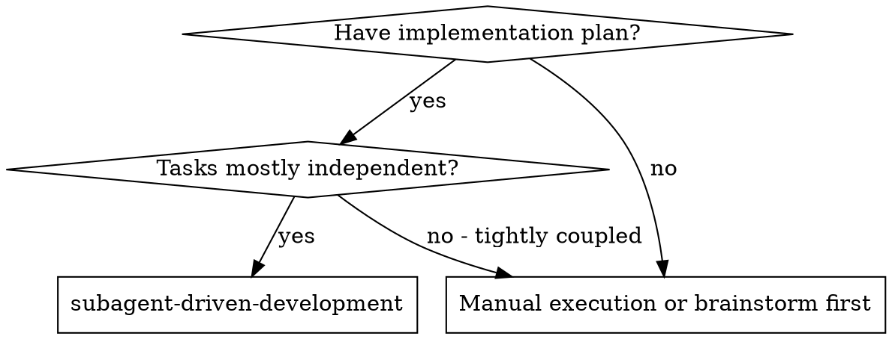
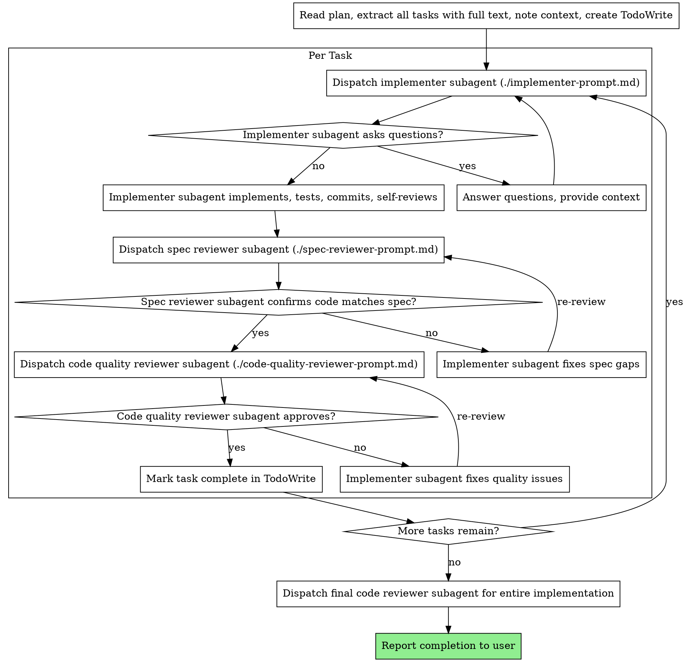

# Subagent-Driven Development

通过为每个任务分派全新的 subagent 来执行计划,每个任务完成后进行两阶段审查:首先进行规范符合性审查,然后进行代码质量审查。

**为什么使用 subagents:** 你将任务委托给具有隔离上下文的专业化 agents。通过精确构建它们的指令和上下文,你可以确保它们保持专注并成功完成任务。它们不应该继承你会话的上下文或历史记录——你只需要构建它们确切需要的内容。这也保留了你自己的上下文用于协调工作。

**核心原则:** 每个任务使用全新的 subagent + 两阶段审查(先规范后质量)= 高质量、快速迭代

## 何时使用



## 流程



## 模型选择

使用能够处理每个角色的最低能力模型来节省成本并提高速度。

**机械性实现任务**(独立函数、清晰规范、1-2 个文件):使用快速、廉价的模型。当计划规范明确时,大多数实现任务都是机械性的。

**集成和判断任务**(多文件协调、模式匹配、调试):使用标准模型。

**架构、设计和审查任务**:使用最强大的可用模型。

**任务复杂度信号:**
- 涉及 1-2 个文件且有完整规范 → 廉价模型
- 涉及多个文件且有集成考虑 → 标准模型
- 需要设计判断或广泛代码库理解 → 最强模型

## 处理 Implementer 状态

Implementer subagents 报告四种状态之一。适当处理每种状态:

**DONE:** 继续进行规范符合性审查。

**DONE_WITH_CONCERNS:** Implementer 完成了工作但标记了疑虑。在继续之前阅读这些疑虑。如果疑虑是关于正确性或范围的,在审查前解决它们。如果它们是观察性的(例如,"这个文件变大了"),记录它们并继续审查。

**NEEDS_CONTEXT:** Implementer 需要未提供的信息。提供缺失的上下文并重新分派。

**BLOCKED:** Implementer 无法完成任务。评估阻塞原因:
1. 如果是上下文问题,提供更多上下文并使用相同模型重新分派
2. 如果任务需要更多推理,使用更强大的模型重新分派
3. 如果任务太大,将其分解为更小的部分
4. 如果计划本身有误,升级给人工处理

**绝不**忽略升级或强制相同模型在没有更改的情况下重试。如果 implementer 说它卡住了,就需要做出改变。

## Prompt 模板

- `./implementer-prompt.md` - 分派 implementer subagent
- `./spec-reviewer-prompt.md` - 分派规范符合性审查 subagent
- `./code-quality-reviewer-prompt.md` - 分派代码质量审查 subagent

## 示例工作流程

```
You: 我正在使用 Subagent-Driven Development 来执行这个计划。

[Read plan file once: docs/superpowers/plans/feature-plan.md]
[Extract all 5 tasks with full text and context]
[Create TodoWrite with all tasks]

Task 1: Hook installation script

[Get Task 1 text and context (already extracted)]
[Dispatch implementation subagent with full task text + context]

Implementer: "开始之前 - hook 应该安装在用户级还是系统级?"

You: "用户级 (~/.config/superpowers/hooks/)"

Implementer: "明白了。现在开始实现..."
[Later] Implementer:
  - Implemented install-hook command
  - Added tests, 5/5 passing
  - Self-review: Found I missed --force flag, added it
  - Committed

[Dispatch spec compliance reviewer]
Spec reviewer: ✅ Spec compliant - all requirements met, nothing extra

[Get git SHAs, dispatch code quality reviewer]
Code reviewer: Strengths: Good test coverage, clean. Issues: None. Approved.

[Mark Task 1 complete]

Task 2: Recovery modes

[Get Task 2 text and context (already extracted)]
[Dispatch implementation subagent with full task text + context]

Implementer: [No questions, proceeds]
Implementer:
  - Added verify/repair modes
  - 8/8 tests passing
  - Self-review: All good
  - Committed

[Dispatch spec compliance reviewer]
Spec reviewer: ❌ Issues:
  - Missing: Progress reporting (spec says "report every 100 items")
  - Extra: Added --json flag (not requested)

[Implementer fixes issues]
Implementer: Removed --json flag, added progress reporting

[Spec reviewer reviews again]
Spec reviewer: ✅ Spec compliant now

[Dispatch code quality reviewer]
Code reviewer: Strengths: Solid. Issues (Important): Magic number (100)

[Implementer fixes]
Implementer: Extracted PROGRESS_INTERVAL constant

[Code reviewer reviews again]
Code reviewer: ✅ Approved

[Mark Task 2 complete]

...

[After all tasks]
[Dispatch final code-reviewer]
Final reviewer: All requirements met, ready to merge

向用户汇报所有任务已完成。
```

## Final Code Review：如何派遣与处理反馈

### 派遣 final code reviewer

所有任务完成后，主 agent 执行：

**1. 获取 git SHA：**
```bash
BASE_SHA=$(git rev-parse origin/main)  # 本次开发的起点
HEAD_SHA=$(git rev-parse HEAD)
```

**2. 派遣 code-reviewer subagent，填写以下上下文：**
- `WHAT_WAS_IMPLEMENTED`：本次实现的内容概述
- `PLAN_OR_REQUIREMENTS`：对应的 spec/plan 文件路径
- `BASE_SHA` / `HEAD_SHA`：审查范围
- `DESCRIPTION`：简要总结

### 处理 final code review 反馈

代码审查需要技术评估，不是情感表演。**核心原则：先验证再实施，技术正确性优于社交舒适度。**

**处理流程：**
```
1. 阅读：完整阅读反馈，不做即时反应
2. 理解：用自己的话重述需求（或提问澄清）
3. 验证：对照代码库实际情况检查
4. 评估：对本代码库技术合理吗？
5. 响应：技术性确认或有理有据的反驳
6. 实施：一次一项，逐个测试，验证无回归
```

**按优先级处理：**
- **Critical**：立即修复，不继续其他工作
- **Important**：修复后才能继续
- **Minor**：记录后处理

**不清楚的反馈：先澄清，再实施。** 部分理解 = 错误实施。

**禁止的响应：**
- ❌ "You're absolutely right!" / "Great point!" （表演性同意）
- ❌ "Let me implement that now"（验证之前）
- ❌ 任何感谢表达（行动说话，直接修复）

**正确的响应：**
- ✅ "已修复。[变更内容的简要描述]"
- ✅ 直接修复并在代码中展示

### 何时反驳

在以下情况用技术推理反驳（而非接受）：
- 建议破坏现有功能
- 审查者缺乏完整上下文
- 违反 YAGNI（建议添加未被调用的功能）
- 对此技术栈技术不正确
- 与已有架构决策冲突

**YAGNI 检查：** 如果审查者建议添加某功能，先 grep 代码库确认是否有实际调用，没有则反驳："没有代码调用此功能，移除它（YAGNI）？"

## 优势

**对比手动执行:**
- Subagents 自然遵循 TDD
- 每个任务全新的上下文(无混淆)
- 并行安全(subagents 不会相互干扰)
- Subagent 可以提问(工作前和工作期间)

**效率提升:**
- 无文件读取开销(控制器提供完整文本)
- 控制器精确策划所需的上下文
- Subagent 预先获得完整信息
- 问题在工作开始前浮现(而非之后)

**质量门控:**
- 自审查在交接前捕获问题
- 两阶段审查:规范符合性,然后代码质量
- 审查循环确保修复确实有效
- 规范符合性防止过度构建/构建不足
- 代码质量确保实现构建良好

**成本:**
- 更多 subagent 调用(每个任务 implementer + 2 个 reviewers)
- 控制器做更多准备工作(预先提取所有任务)
- 审查循环增加迭代
- 但早期捕获问题(比后期调试更便宜)

## 危险信号

**绝不:**
- 在没有用户明确同意的情况下在 main/master 分支上开始实现
- 跳过审查(规范符合性或代码质量)
- 在未修复问题的情况下继续
- 并行分派多个实现 subagents(冲突)
- 让 subagent 读取计划文件(改为提供完整文本)
- 跳过场景设置上下文(subagent 需要理解任务适用的位置)
- 忽略 subagent 问题(在让它们继续之前回答)
- 在规范符合性上接受"足够接近"(spec reviewer 发现问题 = 未完成)
- 跳过审查循环(reviewer 发现问题 = implementer 修复 = 再次审查)
- 让 implementer 自审查替代实际审查(两者都需要)
- **在规范符合性 ✅ 之前开始代码质量审查**(顺序错误)
- 在任一审查有未解决问题时进入下一个任务

**如果 subagent 提问:**
- 清晰完整地回答
- 如有需要提供额外上下文
- 不要急于让它们开始实现

**如果 reviewer 发现问题:**
- Implementer(相同 subagent)修复它们
- Reviewer 再次审查
- 重复直到批准
- 不要跳过重新审查

**如果 subagent 任务失败:**
- 分派修复 subagent 并提供具体指令
- 不要尝试手动修复(上下文污染)

## 集成

**必需的工作流 skills:**
- **superpowers:writing-plans** - 创建此 skill 执行的计划

**Subagents 应使用:**
- **superpowers:test-driven-development** - Subagents 为每个任务遵循 TDD
