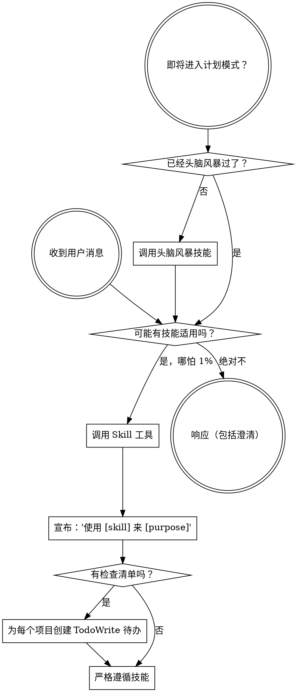

<SUBAGENT-STOP>
如果你作为子代理被派发来执行特定任务，跳过此技能。
</SUBAGENT-STOP>

<EXTREMELY-IMPORTANT>
如果你认为某个技能有哪怕 1% 的可能性适用于你正在做的事情，你绝对必须调用该技能。

如果技能适用于你的任务，你没有选择。你必须使用它。

这是不可商量的。这不是可选的。你不能找理由回避它。
</EXTREMELY-IMPORTANT>

## 指令优先级

Superpowers 技能覆盖默认系统提示行为，但**用户指令始终具有优先权**：

1. **用户的明确指令** (CLAUDE.md, GEMINI.md, AGENTS.md, 直接请求) — 最高优先级
2. **Superpowers 技能** — 在冲突处覆盖默认系统行为
3. **默认系统提示** — 最低优先级

如果 CLAUDE.md、GEMINI.md 或 AGENTS.md 说"不要使用 TDD"，而某个技能说"总是使用 TDD"，请遵循用户指令。用户拥有控制权。

## 如何访问技能

**在 Claude Code 中：** 使用 `Skill` 工具。当你调用技能时，其内容会被加载并呈现给你——直接遵循它。永远不要使用 Read 工具读取技能文件。

**在 Copilot CLI 中：** 使用 `skill` 工具。技能从已安装的插件中自动发现。`skill` 工具的工作方式与 Claude Code 的 `Skill` 工具相同。

**在 Gemini CLI 中：** 技能通过 `activate_skill` 工具激活。Gemini 在会话开始时加载技能元数据，并按需激活完整内容。

**在其他环境中：** 查阅你平台的文档了解技能如何加载。

## 平台适配

技能使用 Claude Code 工具名称。非 CC 平台：参阅 `references/copilot-tools.md` (Copilot CLI)、`references/codex-tools.md` (Codex) 了解工具对应关系。Gemini CLI 用户通过 GEMINI.md 自动加载工具映射。

# 使用技能

## 规则

**在任何响应或操作之前调用相关或请求的技能。** 哪怕只有 1% 的可能性技能适用，你也应该调用技能进行检查。如果调用的技能经证实不适用于当前情况，你不需要使用它。

## 危险信号

这些想法意味着停止——你在找借口：

| 想法 | 现实 |
|---------|---------|
| "这只是一个简单的问题" | 问题就是任务。检查技能。 |
| "我需要先了解更多上下文" | 技能检查在澄清问题之前。 |
| "让我先探索代码库" | 技能告诉你如何探索。先检查。 |
| "我可以快速检查 git/文件" | 文件缺少对话上下文。检查技能。 |
| "让我先收集信息" | 技能告诉你如何收集信息。 |
| "这不需要正式的技能" | 如果存在技能，就使用它。 |
| "我记得这个技能" | 技能会演进。读取当前版本。 |
| "这不算任务" | 行动 = 任务。检查技能。 |
| "这个技能太重了" | 简单的事情会变复杂。使用它。 |
| "我先做这一件事" | 在做任何事之前检查。 |
| "这感觉很高效" | 无纪律的行动浪费时间。技能防止这种情况。 |
| "我知道那是什么意思" | 知道概念 ≠ 使用技能。调用它。 |

## 技能优先级

当多个技能可能适用时，使用此顺序：

1. **流程技能优先** (brainstorming, debugging) - 这些决定如何处理任务
2. **实现技能其次** (frontend-design, mcp-builder) - 这些指导执行

"让我们构建 X" → 先 brainstorming，然后实现技能。
"修复这个 bug" → 先 debugging，然后领域特定技能。

## 技能类型

**严格型** (TDD, debugging)：严格遵循。不要调整掉纪律性。

**灵活型** (patterns)：根据上下文调整原则。

技能本身会告诉你它属于哪种类型。

## 用户指令

指令说明做什么，而不是怎么做。"添加 X" 或 "修复 Y" 不意味着跳过工作流程。
